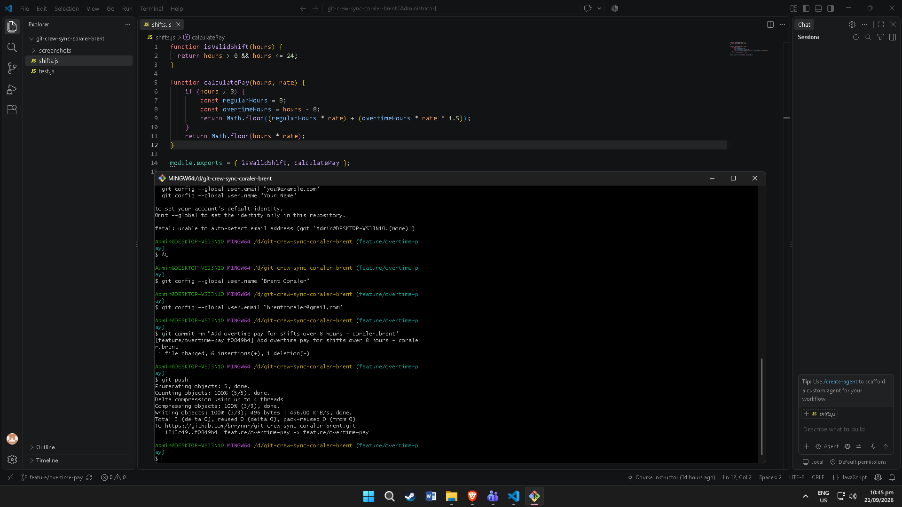
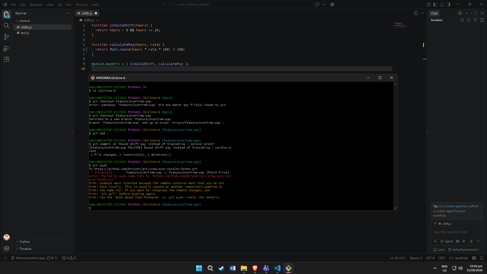
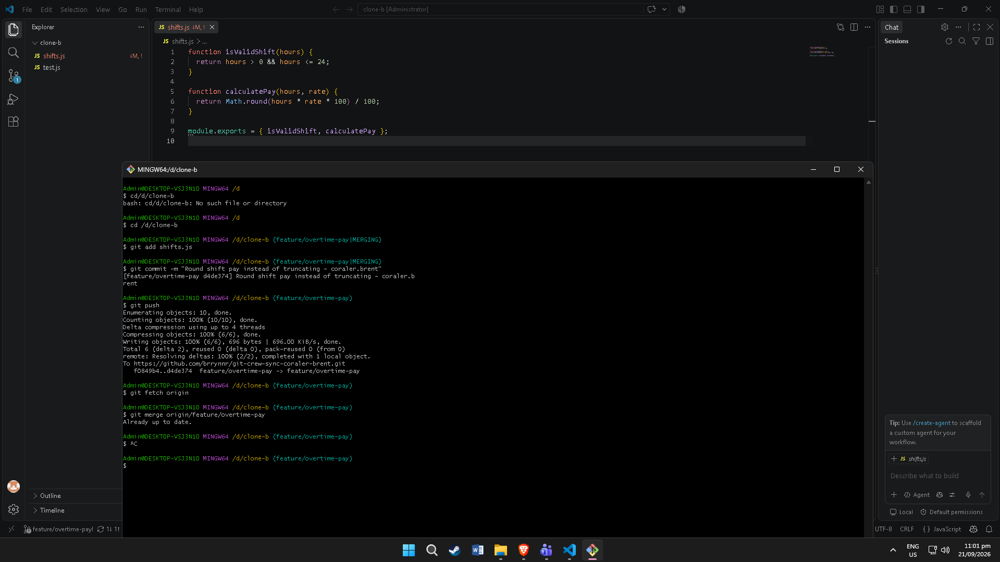
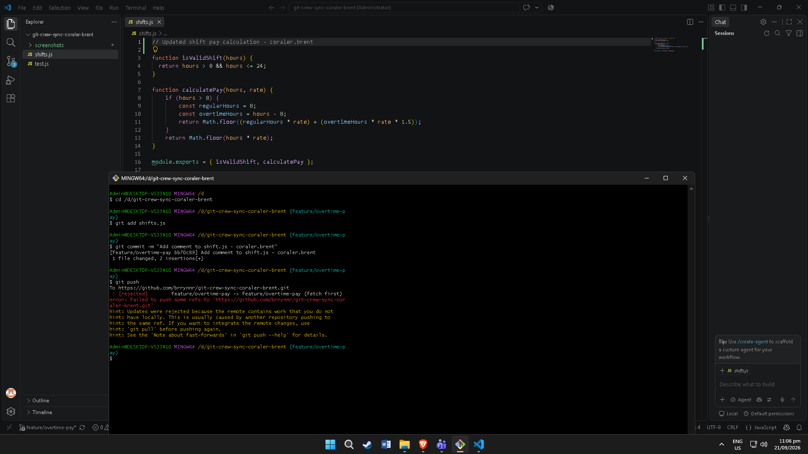
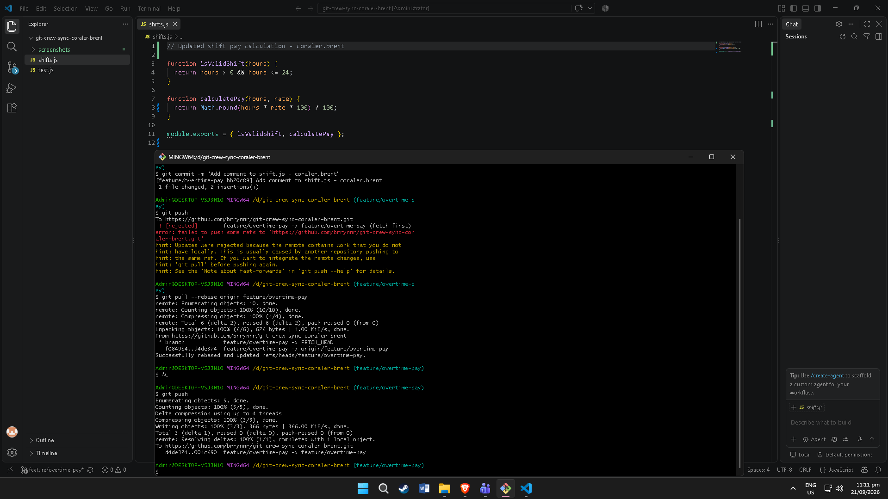
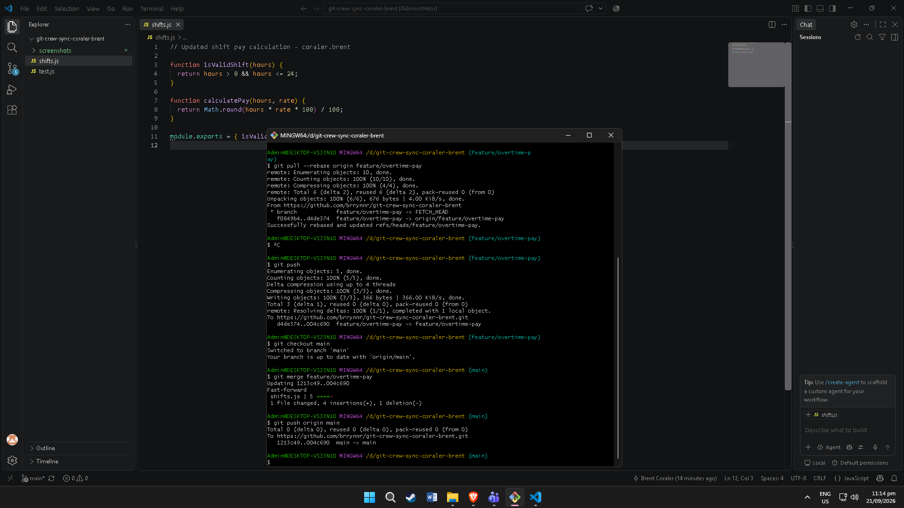
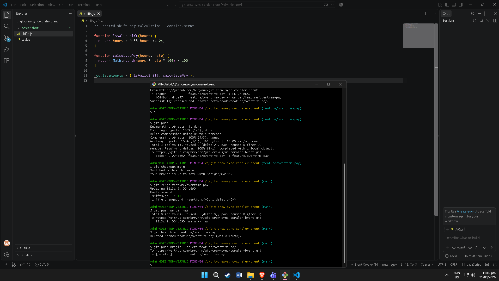

# Crew Sync: Reconciling Divergent Work Workflow

## Task 1: Overtime Pay Implementation
Implemented overtime pay calculation logic for shifts exceeding 8 hours using `Math.floor` and pushed the changes to the remote repository.

## Task 2: Conflicting Remote Pushes
Attempted to push conflicting `Math.round` changes from Clone B without pulling first, resulting in a rejected push from GitHub.

## Task 3: Reconciling with a Merge
Fetched remote updates in Clone B, resolved the merge conflict in `shifts.js` by retaining the overtime logic, and pushed the merge commit.

## Task 4: Reconciling with a Rebase
Attempted to push a local commit from Clone A, rebased local changes on top of the remote tracking branch, and pushed a clean history.

## Task 5: Merging Feature Branch into Main
Switched to the `main` branch, merged `feature/overtime-pay` via fast-forward, and pushed the updated `main` branch to GitHub.

## Task 6: Branch Cleanup
Deleted the `feature/overtime-pay` branch locally and removed it from the remote repository on GitHub.
   